# Python Design Patterns — A Practical Guide

A hands-on tour of the classic Gang of Four (GoF) design patterns, implemented in
clean, idiomatic Python. Each pattern below includes a plain-language explanation,
a diagram, a real-world use case, and a runnable code example in this repo.

## Table of Contents

- [What Are Design Patterns?](#what-are-design-patterns)
- [Creational Patterns](#creational-patterns)
  - [Singleton](#singleton)
  - [Factory Method](#factory-method)
  - [Abstract Factory](#abstract-factory)
  - [Prototype](#prototype)
- [Structural Patterns](#structural-patterns)
  - [Adapter](#adapter)
  - [Decorator](#decorator)
  - [Proxy](#proxy)
- [Behavioral Patterns](#behavioral-patterns)
  - [Observer](#observer)
  - [State](#state)
  - [Strategy](#strategy)
- [How to Run the Examples](#how-to-run-the-examples)

---

## What Are Design Patterns?

Design patterns are reusable, proven solutions to common software design problems.
They aren't finished code you copy-paste — they're **templates for how to structure
relationships between objects and classes** so your code stays flexible, testable,
and easy to extend.

The classic "Gang of Four" book (*Design Patterns: Elements of Reusable
Object-Oriented Software*, 1994) grouped 23 patterns into three categories:

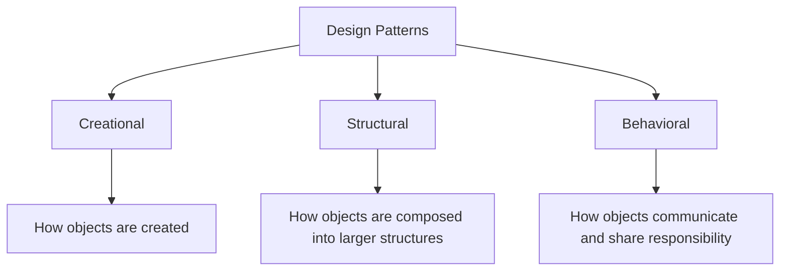

| Category | Answers the question | Patterns in this repo |
|---|---|---|
| **Creational** | "How do I create this object?" | Singleton, Factory Method, Abstract Factory, Prototype |
| **Structural** | "How do these objects fit together?" | Adapter, Decorator, Proxy |
| **Behavioral** | "How do these objects talk to each other and divide responsibility?" | Observer, State, Strategy |

A good rule of thumb: **don't reach for a pattern just to use a pattern.** Each one
exists to solve a specific recurring problem. The sections below explain the
problem first, then show the pattern as the solution.

---

## Creational Patterns

### Singleton

**Problem it solves:** Sometimes you need exactly one instance of a class across
your whole application — a config object, a connection pool, a logger — and you
need every part of the code to share that same instance rather than creating
competing copies.

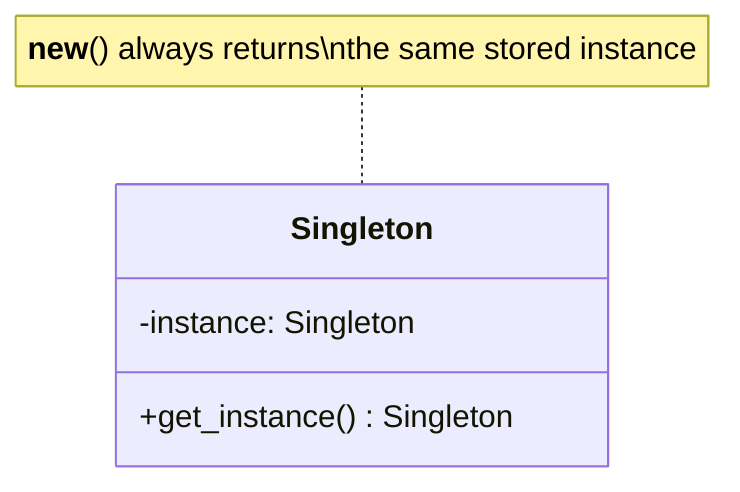

**Key idea:** Override `__new__` to return a stored instance instead of creating a
new one every time the class is called.

**Watch out for:** Singletons introduce global state, which makes unit testing
harder (tests can leak state into each other) and can hide dependencies. Use it
deliberately, not as a default.

📄 Code: [`creational/singleton.py`](creational/singleton.py)

---

### Factory Method

**Problem it solves:** Your code needs to create objects, but it shouldn't need to
know the exact class to instantiate — especially when that decision depends on
runtime input (a config value, a user choice, an API parameter).

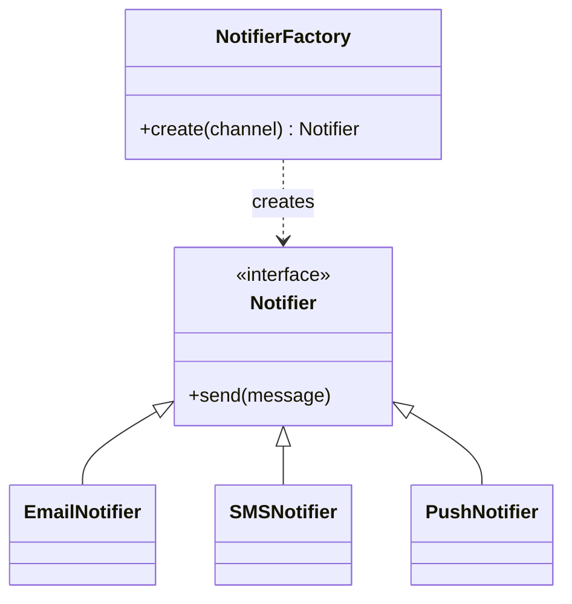

**Key idea:** Centralize `if/elif` object-creation logic into one factory
function/class so adding a new type means adding a new branch (or registering a
new class) in one place, not hunting through the codebase.

📄 Code: [`creational/factory.py`](creational/factory.py)

---

### Abstract Factory

**Problem it solves:** Factory Method creates *one* product. But sometimes you
need to create a whole **family of related objects** that must stay consistent
with each other — e.g., Windows button + Windows checkbox, never a Windows button
mixed with a Mac checkbox.

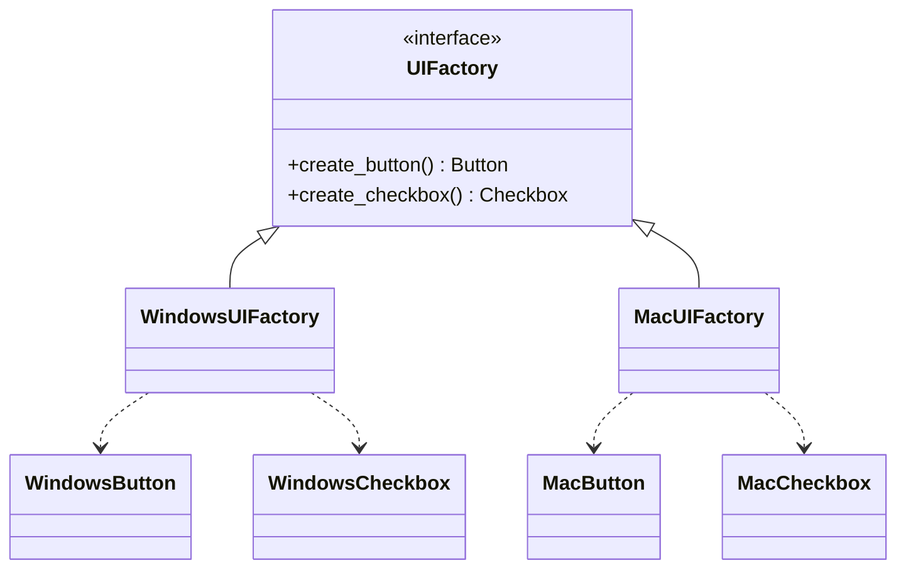

**Key idea:** The factory itself is swappable as a single unit, guaranteeing the
whole family of created objects is compatible.

📄 Code: [`creational/abstract_factory.py`](creational/abstract_factory.py)

---

### Prototype

**Problem it solves:** Creating an object from scratch is expensive (complex setup,
database calls, heavy computation) or you want copies that start from a
pre-configured template rather than default values.

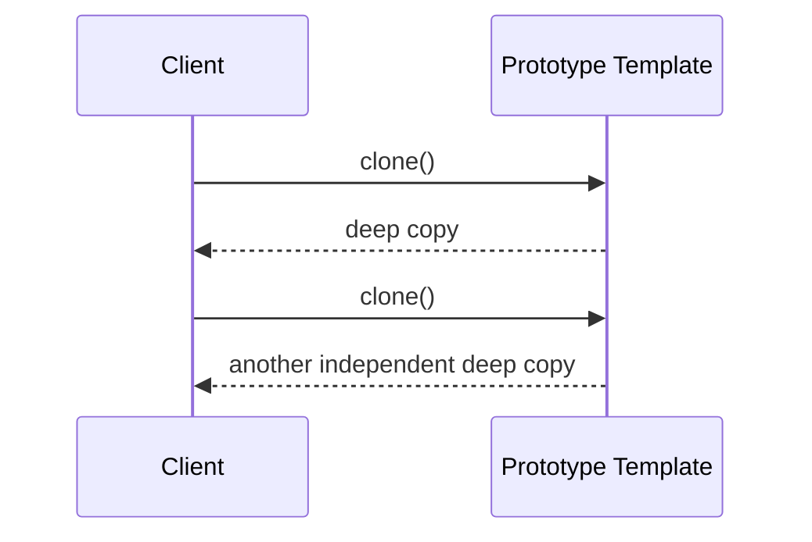

**Key idea:** Clone an existing "template" object (usually via `copy.deepcopy`)
instead of re-running expensive construction logic every time.

📄 Code: [`creational/prototype.py`](creational/prototype.py)

---

## Structural Patterns

### Adapter

**Problem it solves:** You have two pieces of code with incompatible interfaces —
often your code and a third-party library — and you can't (or shouldn't) modify
either one directly.

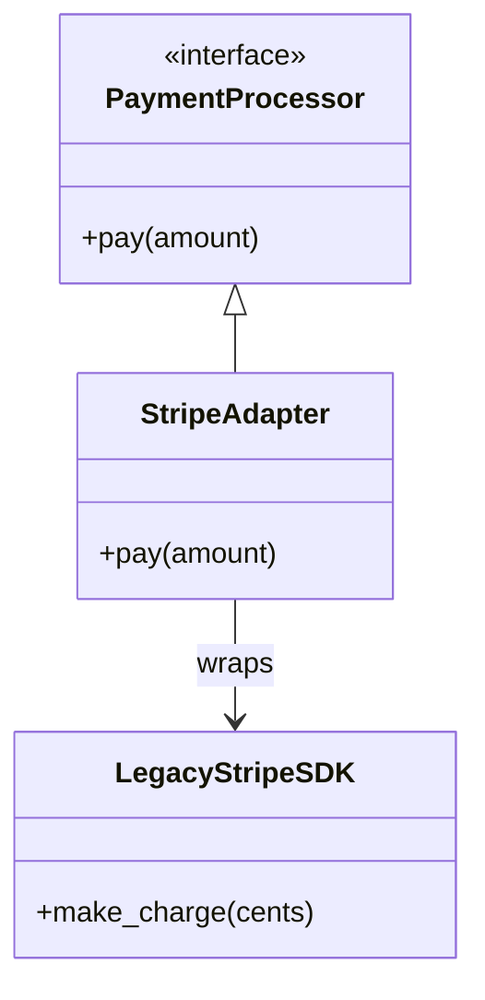

**Key idea:** The adapter implements the interface your code expects, and
internally translates calls into whatever the incompatible class actually needs.

📄 Code: [`structural/adapter.py`](structural/adapter.py)

---

### Decorator

**Problem it solves:** You want to add behavior to an object (logging, caching,
extra features) without permanently modifying its class or creating an explosion
of subclasses for every combination of features.

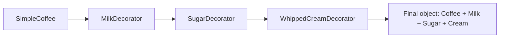

**Key idea:** Each decorator wraps the previous object and implements the same
interface, so decorators can be stacked in any combination at runtime.

📄 Code: [`structural/decorator.py`](structural/decorator.py)

---

### Proxy

**Problem it solves:** You want to control access to an object — delay its
creation until needed, cache its results, check permissions before calling it —
without the client code knowing anything changed.

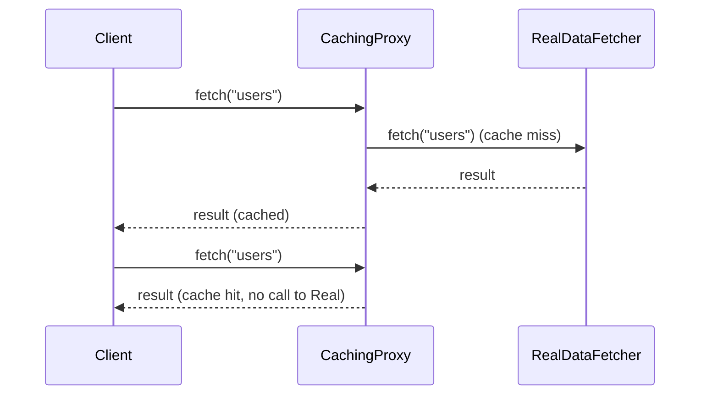

**Key idea:** The proxy implements the exact same interface as the real object, so
it's a drop-in replacement — the client can't tell it's talking to a proxy.

📄 Code: [`structural/proxy.py`](structural/proxy.py)

---

## Behavioral Patterns

### Observer

**Problem it solves:** When one object's state changes, several other objects
need to react — but you don't want to hard-code that list of reactions into the
object itself (that would violate separation of concerns and make it hard to
add/remove reactions later).

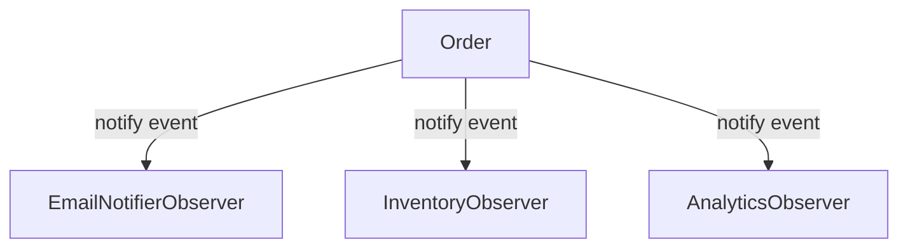

**Key idea:** The subject keeps a list of observers and calls `update()` on each
one when something happens — observers can be added/removed independently of the
subject's core logic. Django/Flask signals are a real-world version of this.

📄 Code: [`behavioral/observer.py`](behavioral/observer.py)

---

### State

**Problem it solves:** An object's behavior depends on a status field, and your
code is full of `if status == "paid": ... elif status == "shipped": ...` blocks
scattered everywhere, making it easy to forget a case or allow an invalid
transition.

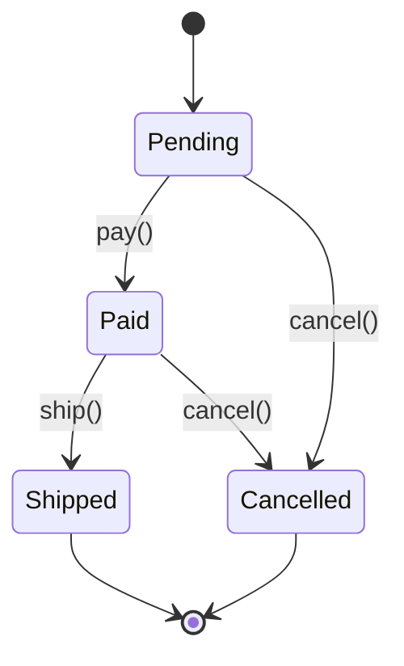

**Key idea:** Each state is its own class that knows exactly which transitions are
valid from that state. The context object just delegates to "whatever state
object it currently holds" — no giant conditional needed.

📄 Code: [`behavioral/state.py`](behavioral/state.py)

---

### Strategy

**Problem it solves:** You have multiple ways to perform an operation (different
discount rules, different sorting algorithms, different pricing models) and need
to choose between them at runtime without an `if/elif` chain embedded in the
calling code.

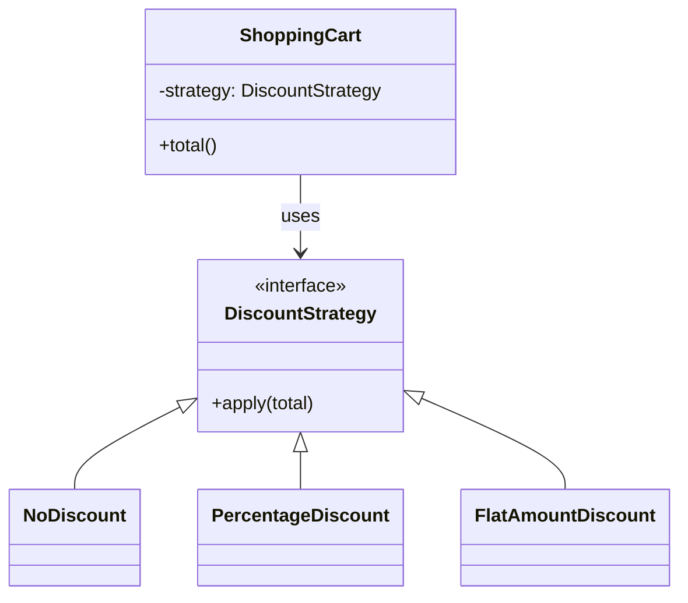

**Key idea:** Each algorithm is encapsulated behind a common interface, and the
context object holds a reference to whichever strategy it's currently using —
swappable at runtime with zero changes to the context's own code.

📄 Code: [`behavioral/strategy.py`](behavioral/strategy.py)

---

## How to Run the Examples

Each pattern file is self-contained and runnable on its own:

```bash
python creational/singleton.py
python creational/factory.py
python creational/abstract_factory.py
python creational/prototype.py

python structural/adapter.py
python structural/decorator.py
python structural/proxy.py

python behavioral/observer.py
python behavioral/state.py
python behavioral/strategy.py
```

No external dependencies required — everything here uses only the Python
standard library, so you can clone this repo and run every example immediately.
